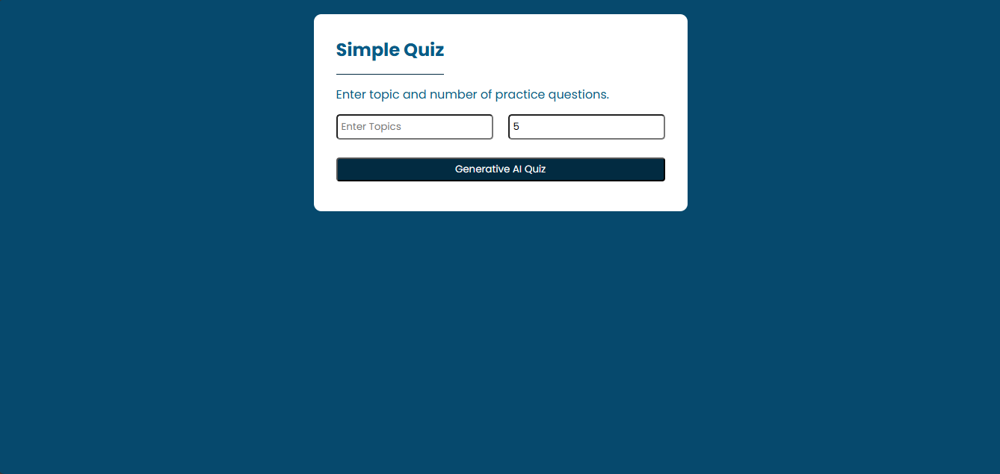
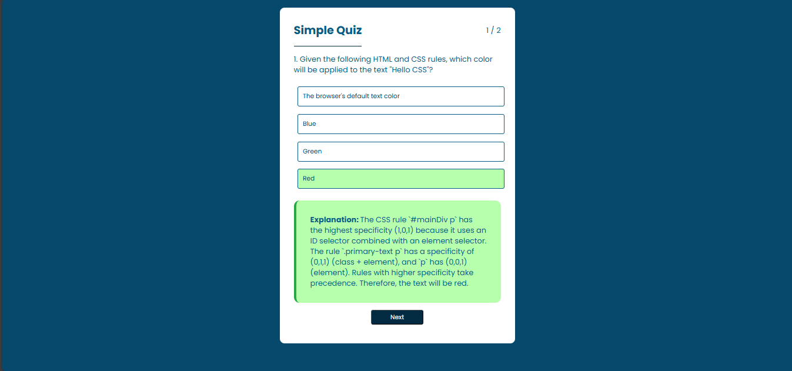

# QuizApp

A simple Quiz app for exploring GS basic questions.

## 🚀 Features

- Real time question answer practice.
- Color response functionality on correct and incorrect answer.
- Getting Scorecard or Play again functionality.

## Description

#### Ek simple aur elegant Quiz Application jisme Aap GS ke questions ka quiz play kar skte ho quiz ke end main apko total correct answer ka scorecard milta hai sath hi play again ki functionality bi milti hai.

## 🛠️ Tech Stack

| Technology     | Use Case                                            |
| :------------- | :-------------------------------------------------- |
| **HTML5**      | For structure and semantic layout.                  |
| **CSS3**       | For interactive design and styling.                  |
| **JavaScript** | For calculating and updating score. |


## 📦 Installation & Setup

Project ko local machine par chalane ke liye niche diye gaye steps follow karein:

Repository Clone karein:

```Bash
git clone https://github.com/Gausha606/QuizApp.git
```

Project Folder mein jayein:

```Bash
cd QuizApp
```

API Key Setup:
config.js file mein apni API key enter karein:

```JavaScript
const CONFIG ={
  API_KEY : "xyz example key"
}
export default CONFIG;
```

Run karein:
`index.html` file ko browser mein open karein (Preferably using Live Server).

---

## 📁 Project Structure

```text
├── index.html          # Main HTML structure
├── style.css           # Styling aur Animations
├── script.js           # Question Answer logic with replay option
└── README.md           # Project Documentation
```

## 📸 Screenshots



